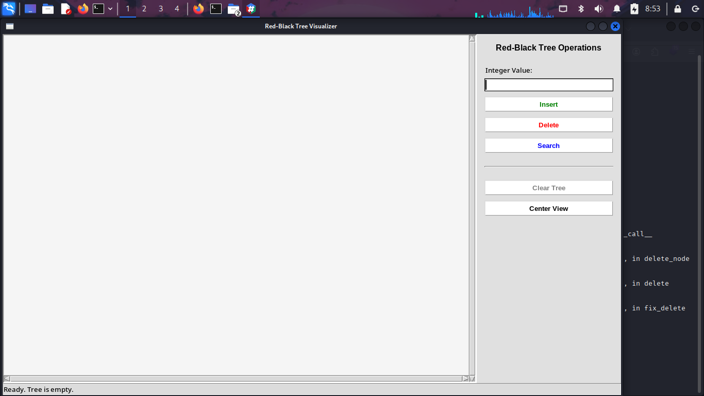
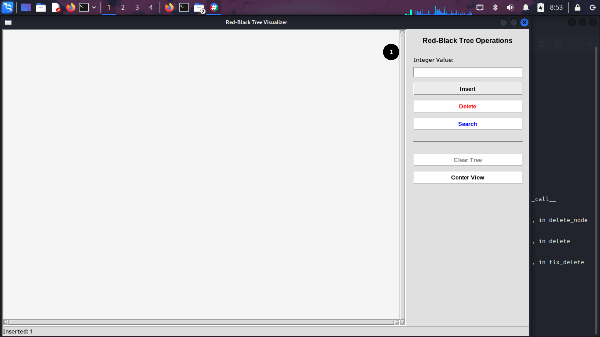
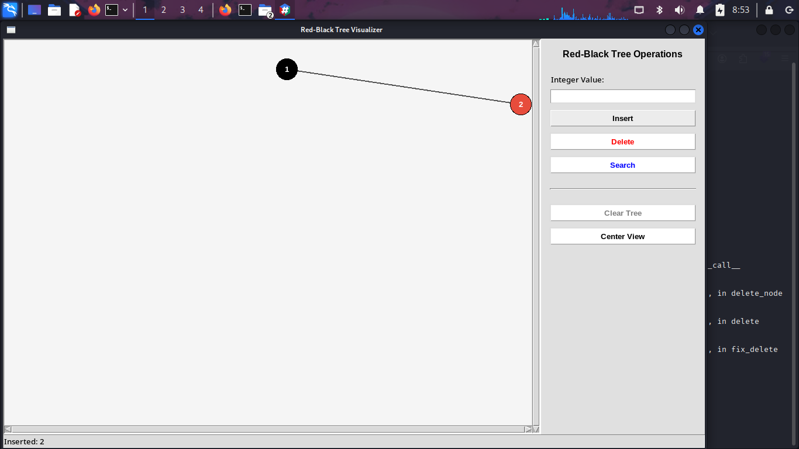
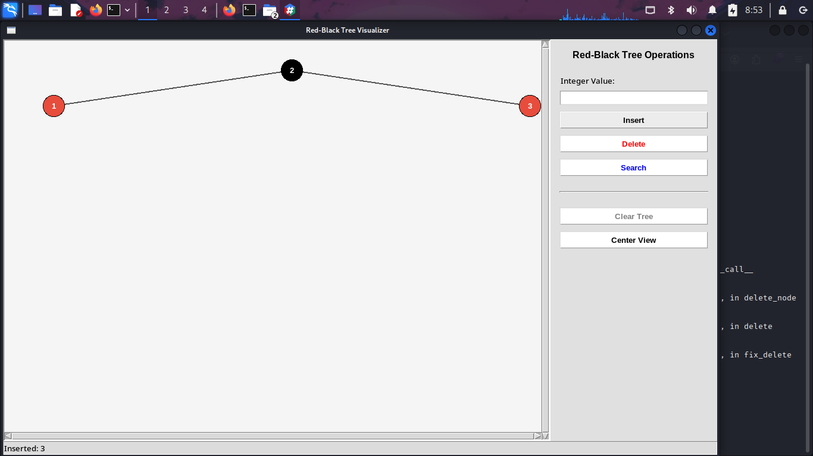
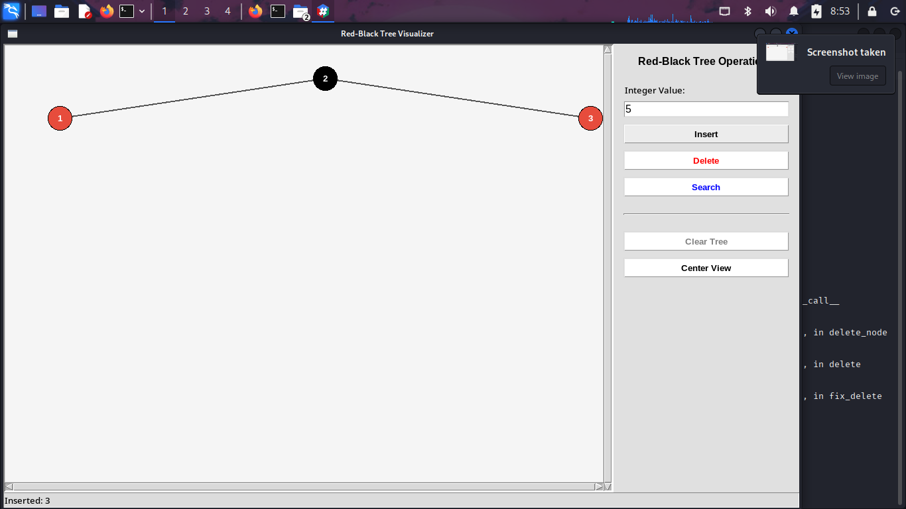
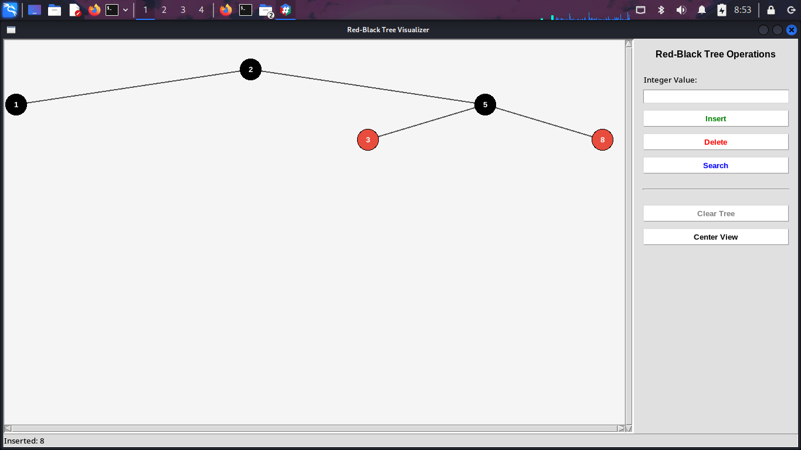
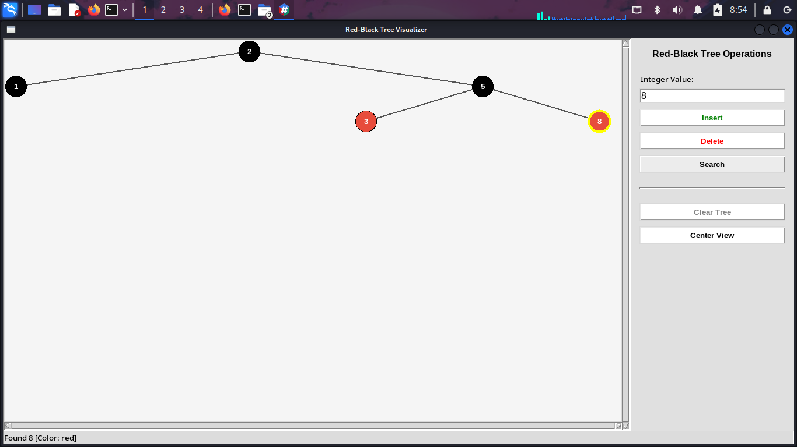
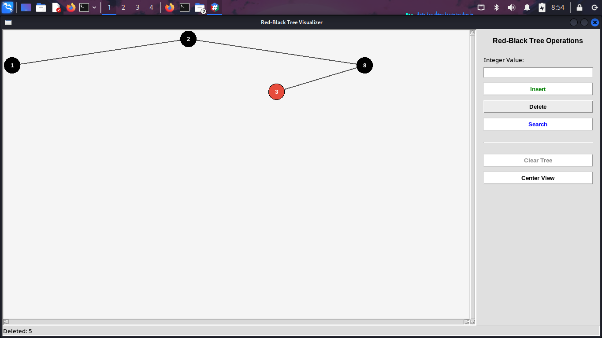

# Red-Black Tree Visualizer (Python + Tkinter)

This project is an interactive **Red-Black Tree** visualization tool
built with **Python** and **Tkinter**.\
It allows you to **insert**, **delete**, and **search** nodes while
dynamically showing the balancing operations performed by the Red-Black
Tree algorithm.

The interface provides: - A graphical tree view (nodes + colors +
structure) - Input controls for operations - Automatic re-centering -
Live updates after each rotation or fix-up - Scrollable canvas for large
trees

------------------------------------------------------------------------

## 🚀 Features

### 🌲 Red-Black Tree Implementation

-   Full RBT logic (insert, delete, fix-up, rotations)
-   Proper handling of NIL/sentinel nodes
-   Root tracking after rotations
-   Clean object-oriented structure (`Node` class)

### 🖥️ GUI Visualizer

-   Built using Python's Tkinter
-   Real-time drawing of:
    -   Node colors (red/black)
    -   Parent/child edges
    -   Highlighted search results
-   Buttons for:
    -   Insert value\
    -   Delete value\
    -   Search value\
    -   Clear tree\
    -   Center canvas view

------------------------------------------------------------------------

## 🔧 Installation

### 1. Clone the repository:

``` bash
git clone https://github.com/bousbiamouhamedbachir/RedBlackTree.git
cd RedBlackTree
```

### 2. Make sure you have Python 3 installed:

``` bash
python3 --version
```

### 3. Run the application:

``` bash
python3 main.py
```

------------------------------------------------------------------------

## 📁 Project Structure

    RedBlackTree/
    │── main.py         # Tkinter GUI visualizer
    │── node.py         # Red-Black Tree implementation
    │── README.md       # Documentation

------------------------------------------------------------------------

## 🧑‍💻 Author

**Bousbia Mouhamed Bachir**
**Azizi Naceur**
------------------------------------------------------------------------

## ⭐ Contributions

Pull requests and suggestions are welcome.\
Feel free to fork the project and improve the visualizer!
------------------------------------------------------------------------
## Pictures 









